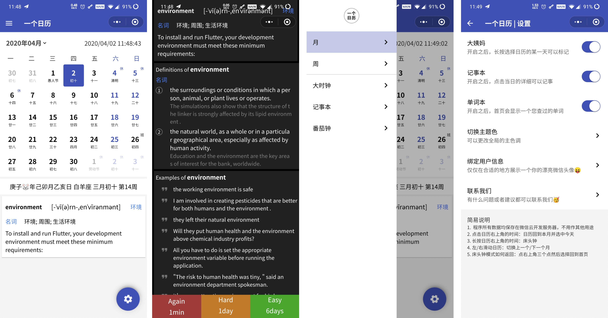

# 一个日历 - 做一个简洁实用的日历工具

## 开发历程

1. 一开始只是觉得需要一个可以看到节假日的日历，别的日历都太复杂了，太臃肿看着不爽

2. 为了100%的简洁，所以所有额外功能都是默认保持关闭状态

## todo

0. [x] 基本日历功能

0. [x] 节假日功能

0. [x] 背单词功能

0. [x] 生词两大来源之一：Chrome浏览器插件查词功能

0. [ ] 生词两大来源之二：移动App，iOS，Android

0. [x] 番茄钟

0. [x] 记事本功能

0. [x] 记事本视图

0. [x] 周视图，日程安排

## 截图



## 单词功能(待完善)

在日历上复习你阅读中查过的词，[Chrome插件取词插件地址](https://chrome.google.com/webstore/detail/pdmhnijfmbifakadpggckbmjgdclaaio)

1. 接触生词的来源是平常网上的阅读

2. 参考 `Anki` 的 `艾宾浩斯遗忘曲线` 的复习提醒，以及对单词的印象：不认识(1m Again)、复杂(5m Hard)、一般(10m Good)、简单(4d Easy)，的三个自我认识和理解

### 艾宾浩斯遗忘曲线 的实现
```
timeSort
nextReviewDate = 
R=e^（-t/S)，其中R是被记忆的内容，t是时间，S是相对记忆强度
R=e^（-1/1)=0.36787944117
R=e^（-1/2)=0.60653065971
R=e^（-1/3)=0.71653131057
R=e^（-1/4)=0.77880078307

单词第一次出现，三个选项：10min 1day 4day，选了第一个则加入队列继续复习，直到可以隔天记忆，
计算得R=e^（-1/1)=0.36787944117，超过三次，只能选择1day复习，30*(1/4)
0.36*1.36 
S=10/in(0.36)=10天 S=10/in(0.36)=10天
in(0.36) = -1

where R is retrievability (a measure of how easy it is to retrieve a piece of information from memory),
 S is stability of memory (determines how fast R falls over time in the absence of training, testing or other recall),
 and t is time.
艾宾浩斯遗忘曲线，图中竖轴表示学习中记住的知识数量，横轴表示时间(天数)，曲线表示记忆量变化的规律
```

## 小程序

NavigationBarPaddingTop = MenuButtonTop - StatusBarHeight
NavigationBarPaddingBottom = NavigationBarPaddingTop
NavigationBar = StatusBarHeight + NavigationBarPaddingTop + NavigationBarPaddingBottom + MenuButtonHeight

## 扫码体验


